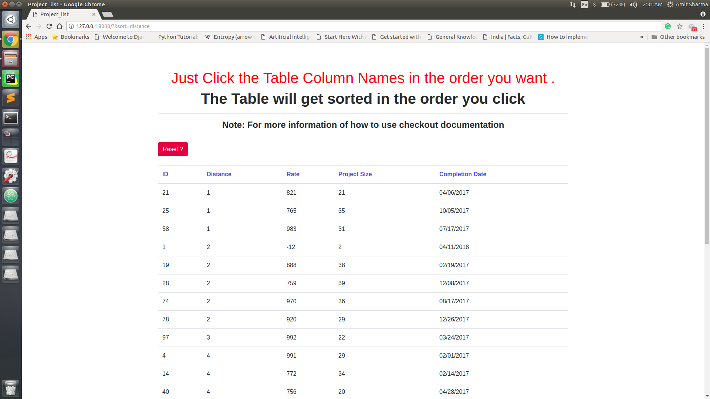
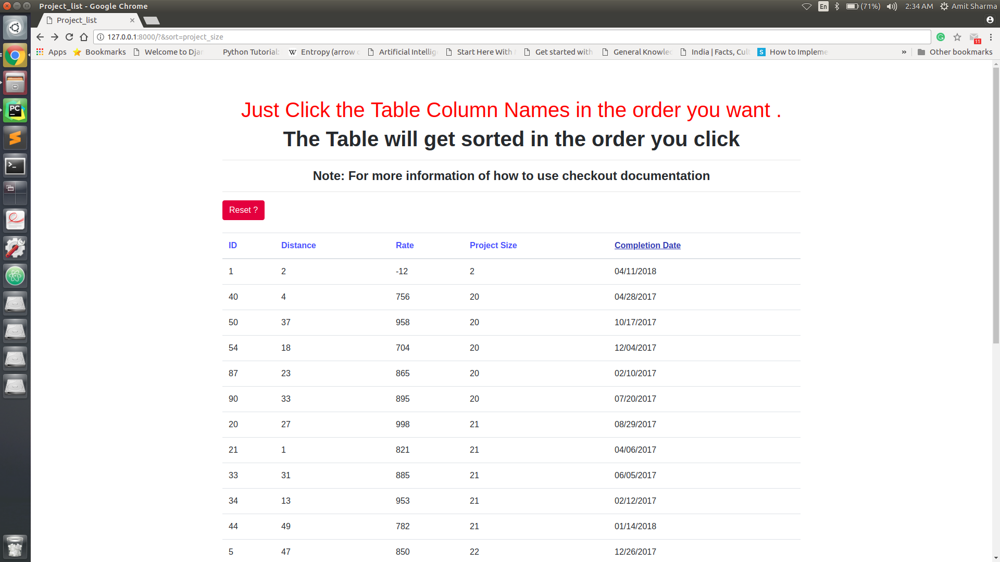

# table_sorting_algorithms
<h1>Introduction :</h1> 
This project is made to ease the work of querying large datasets by:  
having a a click based query system , where the order you click the columns they get sorted in that order.
<h1>Usage</h1>
<ol>
<li>When the website opens it is already sorted in the order of serial number '#' </li>
<li>When you click the first column it sorts the table in that order where that perticular 
column is taken into account.</li>
<li>When you click the second column except the column already clicked before , it sorts the table based
on both the columns where the first selected column is given priority first and second
selected column is given priority second.</li>
<li>whenever you click the last selected column again ( twice ) the whole table is reset
and the table is again sorted based on the last selected column only.</li>
<li>so to reset the column back to normal state (same as in order of serial number):
 <ul>
 <li>just click the serial number twice or</li>
 <li> <strong>Click The Reset Button</strong></li>
 </ul>
</li>
</ol>

<h1>Requiments</h1>
<ol>
<li>Django 1.11</li>
<li>Python 2.7</li>
</ol>

<h1>ScreenShots</h1>
<ol>
<li>
<h2>Main Screen</h2>
<cation>Already sorted with serial number ! </caption>

  

</li>

<li>
<h2>After Clicking Distance</h2>

  

</li>

<li>
<h2>Clicked : Distance First -> Then Rate </h2>

  

</li>

<li>
<h2>Clicked : Distance First -> Then Completion Date </h2>

  

</li>

<li>
<h2>Clicked : Rate</h2>

  

</li>

<li>
<h2>Clicked : Project Size</h2>

  

</li>

<li>
<h2>Clicked : Project Size First -> then Compleation Date</h2>

  

</li>

</ol>